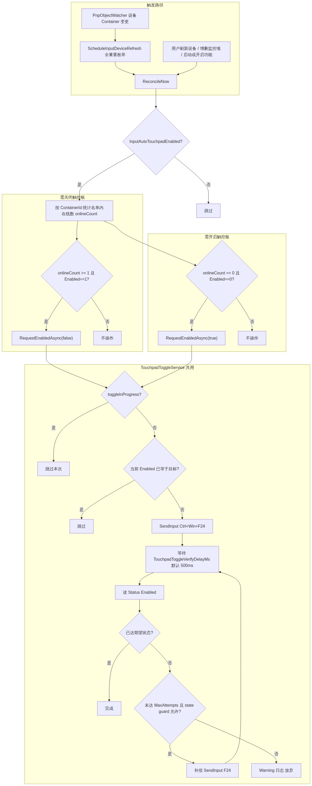
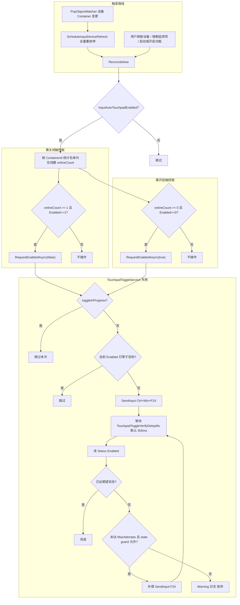
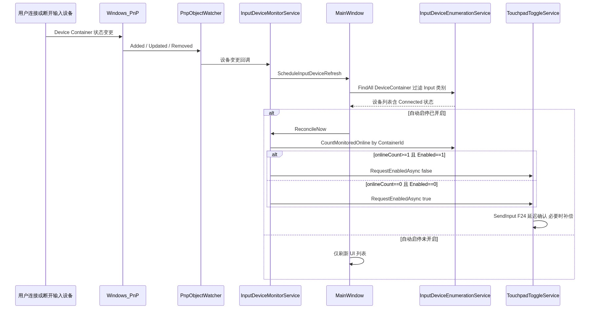
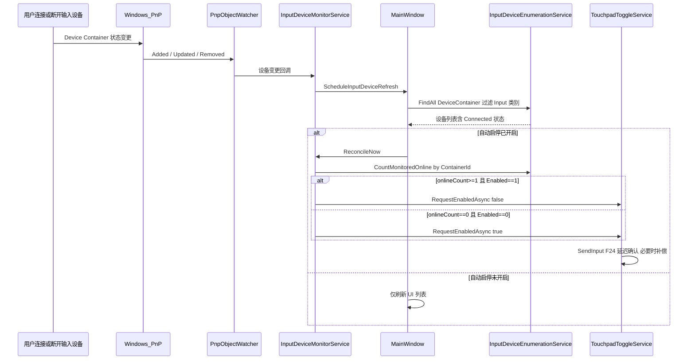
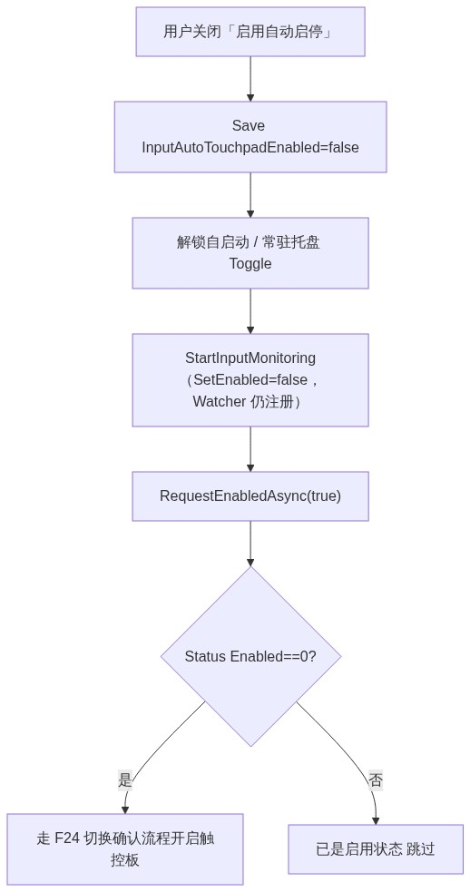
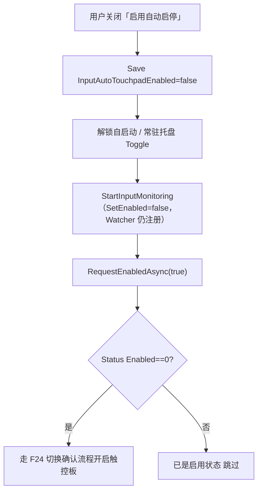

# Touchpad Shield 版本变更说明（v1.0.0 → v1.1.0）

> **基准文档：** v1.0.0 最终发行版 `README.md`、`Touchpad_Shield_开发指导.md`（build 0031 / 0032）  
> **当前版本：** v1.1.0 build 0081（`version/Version.props`）  
> **撰写日期：** 2026-07-22

本文档梳理自 v1.0.0 正式版至当前 v1.1.0 的**用户可见功能**、**界面调整**、**架构与持久化变更**，供产品、开发与发布说明引用。

---

## 一、版本概览

| 项目 | v1.0.0 | v1.1.0（当前） |
|------|--------|----------------|
| 语义化版本 | 1.0.0 | **1.1.0** |
| 产品定位 | PTP 调优 + 示意图 + CSV 机型尺寸 | 在 v1.0.0 基础上增加**外接输入设备自动启停触控板**及**后台常驻能力** |
| 主窗口布局 | 左右 **两栏**（4:6） | 左 / 中 / 右 **三栏**（41:55:34） |
| 最小窗口 | 1280×900（逻辑像素） | **1560×900**（逻辑像素） |
| 右栏内容 | 无（机型/尺寸/示意图占满中部+右部） | 独立第三栏：**触控板自动启停** |

v1.0.0 已有的 PTP 灵敏度、Curtains / Super Curtains、BIOS 匹配、CSV、示意图、UAC、StartupWindow、构建流水线等**均保留**；v1.1.0 为**功能扩展版本**，非重写。

---

## 二、新增功能（v1.1.0）

### 2.1 外接输入设备自动启停触控板（核心）

| 能力 | 说明 |
|------|------|
| **启用自动启停** | 右栏开关；开启后监听用户配置的输入类 Device Container |
| **监控设备列表** | 与 **Windows 设置 → 蓝牙和其他设备 → 设备 → 输入** 同源；支持「添加 / 移除」 |
| **自动行为** | 监控名单内**任一设备在线**且触控板为启用 → `Ctrl+Win+F24` **关闭**内置触控板；全部离线且触控板为禁用 → **重新开启** |
| **切换确认** | `SendInput` 后延迟 500ms 读 `Status\Enabled`，未达期望最多补偿 1 次 |
| **设备标识** | 使用 **ContainerId**（非 VID/PID） |
| **刷新设备** | 右栏「刷新设备」按钮，刷新列表并在开启自动启停时执行一次 reconcile |
| **关闭自动启停** | 若触控板当前为禁用状态，自动走启用流程，避免关闭功能后触控板一直禁用 |

**相关注册表（只读 / 间接）：**

- 读：`HKCU\...\PrecisionTouchPad\Status\Enabled`
- 写：不直接写注册表，通过系统 F24 组合键切换

> 完整流程图见 **[二附、触控板自动启停流程](#二附触控板自动启停流程v110-实现)**。

### 2.2 系统托盘

| 能力 | 说明 |
|------|------|
| **常驻托盘** | 可选「关闭时缩小到系统托盘」；托盘图标左键打开主窗口、右键菜单（打开 / 退出） |
| **与自动启停联动** | 开启自动启停时**强制**开启「常驻托盘」且 UI 锁定 |
| **退出路径** | 托盘「退出」与窗口关闭逻辑统一，避免僵尸进程 |

### 2.3 开机自启动

| 能力 | 说明 |
|------|------|
| **计划任务自启** | 任务计划程序 `\TouchpadShield`：当前用户**登录时**触发、绑定用户 SAM、`RunLevel=Highest` → `"<exe>" --startup`；清理遗留 HKCU Run 项 |
| **静默启动** | `--startup` 时不显示 StartupWindow / 主窗口，仅初始化托盘与设备监听（仍 UAC） |
| **与自动启停联动** | 开启自动启停时**强制**开启自启动且 UI 锁定 |
| **每用户独立** | 各 Windows 用户 HKCU 设置与计划任务互不影响 |
| **同会话防重复** | `--startup` 成功后写入 `AutostartHandledSessionId`；快速切换回已登录用户无新登录，通常不再次自启 |

### 2.4 单实例

| 能力 | 说明 |
|------|------|
| **Mutex 单实例** | 重复启动时激活已有主窗口（或已最小化到托盘的实例），不启动第二进程 |

### 2.5 启动体验

| 能力 | 说明 |
|------|------|
| **窗口居中** | 首次激活时在工作区内居中显示（`WindowBoundsHelper::CenterOnWorkArea`） |

---

## 二附、触控板自动启停流程（v1.1.0 实现）

> 相对 v1.0.1 内部实现计划（HID + `WM_DEVICECHANGE` + VID/PID）的更新：**Device Container + `PnpObjectWatcher` + ContainerId**；设备列表与 Windows「设置 → 输入」同源；关闭自动启停时若触控板仍为禁用则自动启用。

### 行为规则摘要

| 规则 | v1.1.0 实现 |
|------|-------------|
| 设备来源 | `PnpObject::FindAllAsync(DeviceContainer)`，过滤 `CategoryIds` 含 `Input.`；**排除内置 Precision Touchpad** |
| 列表展示 | 已监控 / 未监控两个列表，「添加」「移除」按钮（非 ComboBox 下拉） |
| 监控键 | **ContainerId** + 显示名 `label` |
| 在线判定 | `System.Devices.Connected == true` |
| 插入逻辑 | 刷新列表后 **onlineCount ≥ 1** 且 `Enabled==1` → 关闭触控板 |
| 拔出逻辑 | 刷新列表后 **onlineCount == 0** 且 `Enabled==0` → 开启触控板 |
| 监听方式 | **`PnpObjectWatcher`** 进程存活期间始终注册；关闭自动启停时仅停止 F24 reconcile，**仍刷新设备列表**（有意设计） |
| 变更后处理 | Watcher 回调 → `ScheduleInputDeviceRefresh` → 全量重枚举 → `ReconcileNow` |
| 切换机制 | `Ctrl+Win+F24`；发送前读 `Status\Enabled` guard；**toggle 进行中跳过新请求** |
| 切换确认 | 延迟 **500ms** 再读注册表；未达期望且 state guard 允许时最多补偿 **1 次** |
| 启动对齐 | `InitializeAsync` 完成设备刷新后，若已开启自动启停则执行一次 reconcile |
| 关闭功能 | 持久化关闭 → `SetEnabled(false)` → **`RequestEnabledAsync(true)`** 尝试恢复触控板 |
| 强制策略 | 开启自动启停时强制并锁定「开机自启动」「常驻托盘」 |

### 目标行为总览

*Mermaid 源文件：[`diagrams/auto-toggle-overview.mmd`](diagrams/auto-toggle-overview.mmd)*

查看 Mermaid 源码

### 设备变更监听时序

*Mermaid 源文件：[`diagrams/device-change-sequence.mmd`](diagrams/device-change-sequence.mmd)*

查看 Mermaid 源码

### 关闭自动启停

v1.0.1 计划未包含；v1.1.0 新增，避免用户关闭功能后触控板一直处于禁用状态。

*Mermaid 源文件：[`diagrams/disable-auto-toggle.mmd`](diagrams/disable-auto-toggle.mmd)*

查看 Mermaid 源码

### 与 v1.0.1 内部 plan 的主要差异

| 项 | v1.0.1 plan | v1.1.0 实现 |
|----|-------------|-------------|
| 设备模型 | HID 接口 + VID/PID | Device Container + **ContainerId** |
| 变更通知 | `RegisterDeviceNotification` + `WM_DEVICECHANGE` | **`PnpObjectWatcher`** |
| reconcile 前置 | 插拔后直接重算 HID 列表 | **先全量重枚举 Container**，再 reconcile |
| 设备 UI | ComboBox + 监控 ListView | **已监控 / 未监控** 双 ListView |
| 关闭功能 | 未约定恢复触控板 | **自动 RequestEnabledAsync(true)** |
| 并发切换 | toggle 进行中忽略新请求 | 同左（`m_toggleInProgress`） |
| 三栏列宽 | 4 : 6 : 3 | **41 : 55 : 34** |

---

## 三、界面与布局变更

### 3.1 主窗口三栏化

**v1.0.0：**

- 顶部：标题 + **刷新数据** + 「更多触控板功能设定」
- 中部：左栏（灵敏度 + 屏蔽区域）| 右栏（机型 + 尺寸 + 示意图），列比 **4:6**

**v1.1.0：**

- 顶部：标题 + 「更多触控板功能设定」（**刷新数据已移出**）
- 中部：左栏 | 中栏 | 右栏，列比 **41:55:34**
  - **左栏：** 「灵敏度设定」标题旁 **刷新数据** + 灵敏度 + 屏蔽区域
  - **中栏：** 笔记本型号、触控板物理尺寸、示意图（自原右栏拆分）
  - **右栏：** 触控板自动启停、监控设备列表、自启动 / 常驻托盘、提示文案

### 3.2 按钮与文案

| 控件 | v1.0.0 | v1.1.0 |
|------|--------|--------|
| 刷新 PTP / CSV / BIOS 数据 | 顶部「刷新数据」 | 左栏「灵敏度设定」旁「刷新数据」 |
| 刷新输入设备 | 无 | 右栏「**刷新设备**」 |
| 自动启停相关 | 无 | 「启用自动启停」「开机自启动」「常驻系统托盘」及条件提示 |

### 3.3 窗口尺寸

| 项 | v1.0.0 | v1.1.0 |
|----|--------|--------|
| 最小 / 初始客户区 | 1280×900 | **1560×900** |
| 原因 | 两栏布局 | 三栏 + 设备列表需要更宽视口 |

---

## 四、持久化与升级（HKCU `Software\ZiMiaoWorkshop\TouchpadShield`）

### 4.1 v1.0.0 已有键（未变）

| 键名 | 用途 |
|------|------|
| `TouchpadWidthMm` / `TouchpadHeightMm` | 触控板物理尺寸 |
| `ClickSensitivityMode` | 单击灵敏度控制方式 |

### 4.2 v1.1.0 新增键

| 键名 | 用途 |
|------|------|
| `InputAutoTouchpadEnabled` | 是否启用触控板自动启停 |
| `MonitoredInputDevices` | 监控设备 JSON（`containerId` + `label` + 可选 `matchKey`） |
| `RunAtStartup` | 登录时自启动（计划任务） |
| `MinimizeToTrayOnClose` | 关闭时缩小到托盘 |
| `AutostartHandledSessionId` | 同会话 `--startup` 已处理（REG_DWORD） |

### 4.3 早期内部开发键（未正式发布）

v1.0.0 / v1.1.0 **正式版不包含** HID 实验键（`HidAutoTouchpadEnabled`、`MonitoredHidDevices`）的读写或迁移。若注册表残留，应用忽略；用户需在界面重新配置监控设备。

---

## 五、新增源码模块（Services）

v1.0.0 开发指导模块表未包含以下组件；v1.1.0 新增：

| 模块 | 职责 |
|------|------|
| `TouchpadStatusService` | 只读 `Status\Enabled` |
| `TouchpadToggleService` | `SendInput` F24 + 延迟校验与补偿 |
| `InputDeviceEnumerationService` | `PnpObject` DeviceContainer 枚举、Input 类别过滤 |
| `InputDeviceMonitorService` | `PnpObjectWatcher`、连接状态 reconcile |
| `InputDeviceTypes` | ContainerId、监控设备结构、匹配逻辑 |
| `TrayIconService` | 系统托盘图标与菜单 |
| `AutoStartService` | 任务计划程序 COM API 注册登录任务（每用户 SAM）；`RemoveRunKey` 清理遗留 Run 项；`AutostartHandledSessionId` 同会话防重复 |
| `SingleInstanceService` | 单实例 Mutex + 激活已有窗口 |
| `XamlLocalTypes.h` | 构建用：为 `XamlTypeInfo.g.cpp` 单独注入窗口头文件 |

`WindowBoundsHelper` 在 v1.0.0 已有最小尺寸逻辑；v1.1.0 增加**启动居中**。

---

## 六、未变更（v1.0.0 能力完整保留）

以下能力与 v1.0.0 一致，仅布局位置或窗口尺寸有调整：

- 单击灵敏度 / 触板灵敏度 / 轻拍单击（HKCU，SPI 优先）
- 缓冲区域 (Smart Area) / 防误触区域 (Smart Edge)（HKLM，需重启）
- 触控板示意图、重叠边两行警告
- BIOS 四字段身份、CSV 匹配 / 应用 / 导出
- StartupWindow 启动等待
- UAC 提权、Curtain 键补全、`RegistryUserContext`
- Debug 日志、代码签名、NSIS 安装包、构建号指纹 bump
- PerMonitorV2 DPI、`DisplayScaleService` 物理尺寸估算

---

## 七、工程与文档（非最终用户可见）

| 类别 | 变更摘要 |
|------|----------|
| **HID 遗留代码** | `HidDevice*` 服务已从工程移除，统一为 `InputDevice*` + Device Container |
| **pch / 编译** | pch 瘦身；`XamlLocalTypes.h` + `/FI` 供生成代码单独 include |
| **代码清理** | 删除 `ShouldMinimizeToTrayOnClose` 转发；提取 `BuildContainerPropertyNamesList`、`BuildInputDeviceListRow` 等 |
| **维护约定** | `PRD/Touchpad_Shield_开发指导.md` §6.1、`.cursor/rules/touchpad-shield-code.mdc` 记录有意不 refactor 的项 |
| **开发指导** | 布局、窗口尺寸、§3.3.1 右栏、持久化键、模块表已更新至 v1.1.0 |
| **README** | 增加 External input / tray / startup 章节及 PTP 表中的触控板总开关行 |

---

## 八、后续仍待实现（两版共同）

以下在 v1.0.0 开发指导 §7.2 已列出，**v1.1.0 仍未实现**：

- 自动从 Windows 系统读取触控板物理尺寸
- 从远程源（如 GitHub）自动更新 `TouchpadPhysicalSize.csv`

v1.1.0 新增规划项：

- 免 UAC 开机自启方案评估

---

## 九、相关文档

| 文档 | 说明 |
|------|------|
| [`Touchpad_Shield_开发指导.md`](Touchpad_Shield_开发指导.md) | 当前实现规格（v1.1.0） |
| [`../README.md`](../README.md) | 对外功能概览与构建说明 |
| [`diagrams/`](diagrams/) | 二附流程图 PNG 与 Mermaid 源文件（`.mmd`） |
| v1.0.0 基准 | 用户提供的最终发行版 README / 开发指导（build 0031–0032） |

发布 GitHub Release 时，可将本文 **第二节～第四节** 摘录为用户向更新说明；技术向流程说明见 **二附**。
