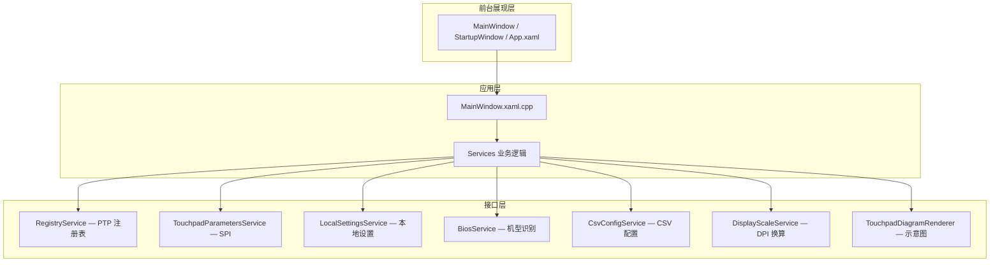

# Touchpad Shield 开发指导

> 本文档基于当前代码库（**v1.1.0**）编写，是 Touchpad Shield 的实现说明、构建规范与需求基线。  
> 自 v1.0.0 起的版本差异见 [`Touchpad_Shield_v1.0.0_to_v1.1.0_变更说明.md`](Touchpad_Shield_v1.0.0_to_v1.1.0_变更说明.md)。  
> 构建规范以 [`.cursor/rules/touchpad-shield-build.mdc`](../.cursor/rules/touchpad-shield-build.mdc) 为准；本文第四节与之保持一致并展开说明。

---

## 一、产品设计目的

本软件名称为 **Touchpad Shield**，作用是通过调整笔记本电脑触控板的 Click Sensitivity、Touchpad Sensitivity、Tap with a single finger to single-click、Curtains 以及 Super Curtains 的数值，来减少用户在使用笔记本电脑键盘打字时，因手掌、手腕、大拇指误触触控板而造成的鼠标光标漂移以及误击现象。

本软件严格遵循微软 Windows 系统 Precision Touchpad Devices 中关于 Precision touchpad tuning 的相关优化指南进行开发，参考链接：

[https://learn.microsoft.com/en-us/windows-hardware/design/component-guidelines/touchpad-tuning-guidelines](https://learn.microsoft.com/en-us/windows-hardware/design/component-guidelines/touchpad-tuning-guidelines)

---

## 二、技术栈与架构

### 2.1 技术栈

| 层级 | 选型 |
|------|------|
| UI 框架 | WinUI 3（**unpackaged**，`WindowsPackageType=None`） |
| 语言 | C++ / C++/WinRT（C++20） |
| 平台 | x64，最低 Windows 10 **17763** |
| 依赖 | Windows App SDK **1.6**、CppWinRT **2.0** |
| 安装包 | NSIS（简体中文 MUI） |
| 构建 | MSBuild + PowerShell 脚本 |
| 版本控制 | 本地 Git（`main` 主干） |

### 2.2 项目目录结构

```text
Touchpad Shield/
├── config/                          # 触控板物理尺寸 CSV（唯一权威编辑位置）
│   └── TouchpadPhysicalSize.csv
├── installer/                       # NSIS 脚本与安装器图标
├── Picture/                         # 品牌 LOGO 源文件
├── PRD/                             # 开发指导文档（本文档所在目录）
├── scripts/                         # 构建、签名、版本、图标脚本
├── src/TouchpadShield/              # WinUI 3 应用源码
│   ├── Services/                    # 业务服务层
│   ├── Assets/                      # 运行时图标资源
│   └── MainWindow.xaml / App.xaml …
├── Touchpad Shield App/             # 编译产物（debug / beta / release）
├── version/                         # Version.props、构建号指纹
└── TouchpadShield.sln
```

### 2.3 软件架构

应用采用三层结构，职责分离如下：



| 层级 | 职责 | 主要文件 |
|------|------|----------|
| **前台展现层** | XAML 布局、控件绑定、主题样式 | `MainWindow.xaml`、`StartupWindow.xaml`、`App.xaml` |
| **应用层** | 页面事件、数据加载、UI 状态与业务编排 | `MainWindow.xaml.cpp`、`App.xaml.cpp` |
| **接口层** | 注册表、SPI、BIOS、CSV、本地设置、DPI、示意图等对外能力封装 | `Services/*` |

---

## 三、功能与界面需求

### 3.1 UI 风格与缩放

（1）前端 UI 样式采用与「Windows 系统设置」一致的风格。界面上主要文字的样式（包括但不限于字体、字号）以及 UI 界面颜色样式，要直接跟随用户在 Windows 操作系统中的设定；各控件的样式以及尺寸也要在 WinUI 3 原生状态下尽量与 Windows 系统设置界面上的控件保持接近。

（2）前端界面必须严格遵循最新 Windows 系统应用的开发要求，必须正确支持 Windows 的缩放功能：
- 应用清单启用 `PerMonitorV2` DPI 感知（`app.manifest`）；
- 窗口最小尺寸、初始客户区尺寸按**逻辑像素**定义，在高 DPI 下通过 `GetDpiForWindow` + `WM_GETMINMAXINFO` 子类化换算物理像素（`WindowBoundsHelper`）；
- 触控板示意图按窗口所在显示器的 **有效 DPI 与显示器逻辑宽度** 估算 `mm/DIP`（`DisplayScaleService`），尽量接近真实物理尺寸渲染；**当前实现未直接读取 EDID**，而是通过 `GetDpiForWindow` / `GetDpiForMonitor` 与 `MONITORINFO` 推算。

（3）区域标题采用**中英双语**格式，例如：`灵敏度设定 (Sensitivity)`、`屏蔽区域设定 (Curtains / Super Curtains)`。

（4）全局样式（`App.xaml`）：
- `MmNumberBoxFieldStyle`：NumberBox 隐藏 spin 按钮，右侧预留 mm 单位显示空间；
- `MmNumberBoxUnitStyle`：输入框内右侧显示 `mm` 单位；
- `RightAlignedToggleSwitchStyle`：ToggleSwitch 右对齐，开关列固定宽度 76px。

---

### 3.2 专用名词中英文对应

| 中文 | 英文 | Windows 系统设置对应 | PTP 键值 |
|------|------|---------------------|----------|
| 灵敏度 | Sensitivity | — | — |
| 单击灵敏度 | Click Sensitivity | 触控板 → 单击灵敏度 | `ClickForceSensitivity` |
| 触板灵敏度 | Touchpad Sensitivity | 触控板 → 触控板灵敏度 | `AAPThreshold` |
| 轻拍触控板进行单击 | Tap with a single finger to single-click | 触控板 → 使用单个手指点击即可单击 | `TapsEnabled` |
| 缓冲区域 | Smart Area | Curtains（屏蔽区域） | `CurtainTop/Bottom/Left/Right` |
| 防误触区域 | Smart Edge | Super Curtains（超级屏蔽区域） | `SuperCurtainTop/Bottom/Left/Right` |

---

### 3.3 页面布局（上、中、下三区）

| 区域 | 内容 |
|------|------|
| **顶部** | 软件名称「Touchpad Shield」、右侧超链接 **更多触控板功能设定**（打开 `ms-settings:devices-touchpad`） |
| **中部** | 左 / 中 / 右三栏（列宽比 **41:55:34**）。左栏：**刷新数据**按钮 + 灵敏度设定 + 屏蔽区域设定；中栏：笔记本型号、触控板物理尺寸、触控板示意图；右栏：外接输入设备与触控板自动启停 |
| **底部** | 左侧（条件显示）：屏蔽区域变更重启提示 + **重启**按钮；右侧：作者信息 + 版本号 |

**窗口与间距：**
- 外层 Grid：`Padding="24,24,24,12"`（底部 12px，其余 24px），`RowSpacing="16"`，`ColumnSpacing="24"`；
- 底部栏固定 `MinHeight="38"`，避免重启提示出现/消失时作者信息与版本号位置跳动。

**窗口尺寸：**
- 最小窗口 **1560×900**（逻辑像素），通过 XAML `MinWidth/MinHeight` 与 `WindowBoundsHelper` 的 `WM_GETMINMAXINFO` 双重约束；
- 首次 `Activated` 时将客户区调整为 1560×900 逻辑尺寸。

---

### 3.3.1 右栏 — 外接输入设备与触控板自动启停 (External Input & Touchpad Auto Toggle)

（1）应用完成 `CompletePlatformSetup` 后始终注册 `PnpObjectWatcher`（进程存活期间），**不做定时轮询**。关闭「启用自动启停」时仅停止 reconcile / F24 切换（`InputDeviceMonitorService::ReconcileNow` 在 `m_enabled==false` 时早退），**不停止 watcher**；设备插拔仍会触发列表刷新，便于随时查看/编辑监控设备。**此为有意设计，非缺陷。**

（2）设备列表与 **Windows 设置 → 蓝牙和其他设备 → 设备 → 输入** 同源：`PnpObject::FindAllAsync(DeviceContainer)`，过滤 `CategoryIds` 含 `Input.` 的容器；**默认排除内置 Precision Touchpad**（`LocalMachine` 与 Touchpad 类别）。仅展示 **`Connected == true` 或 `Paired == true`** 的容器（已配对但未连接仍显示；排除未配对且未连接的历史残留 Container）。

（3）监控键为 **ContainerId**（当前连接实例）+ **matchKey**（跨端口稳定键，优先 `System.Devices.ModelId` 中的 `USB\VID_xxxx&PID_yyyy`，否则回退为规范化显示名）。匹配时两者任一相等即视为同一设备；换 USB 口后会自动更新 ContainerId。在线判定为 `System.Devices.Connected == true`。

（4）行为：
- 名单内任一设备在线且 `Status\Enabled==1` → `SendInput` `Ctrl+Win+F24` 关闭触控板；
- 名单内设备全部离线且 `Status\Enabled==0` → 发送 F24 开启；
- 启动或开启功能时做一次全量对齐（处理启动前已连接设备）。

（5）切换后确认：`SendInput` 后等待 `TouchpadToggleVerifyDelayMs`（默认 **500ms**，代码常量可调），再读 `Status\Enabled`；未达期望则最多补偿 1 次。

（6）启用自动启停时强制并锁定「开机自启动」「点击 X 缩小到系统托盘」；**仅开启开机自启动**时亦强制并锁定「常驻系统托盘」（避免 `--startup` 静默启动后无窗口且无托盘）；托盘在自启、常驻托盘或自动启停任一开启时创建。

（7）持久化键（`Software\ZiMiaoWorkshop\TouchpadShield`，**各 Windows 用户独立 HKCU**）：`InputAutoTouchpadEnabled`、`MonitoredInputDevices`（JSON：`containerId` + `label` + 可选 `matchKey`）、`RunAtStartup`、`MinimizeToTrayOnClose`、`AutostartHandledSessionId`（REG_DWORD，同会话内 `--startup` 已处理标记，内部用）。**正式版不包含**早期内部 HID 实验键（`HidAutoTouchpadEnabled`、`MonitoredHidDevices`）的读写或迁移；若注册表残留此类键，应用忽略。

（8）自启：通过任务计划程序注册 `\TouchpadShield`（**当前用户登录时**触发、触发器与 Principal 绑定当前用户 SAM 名、`RunLevel=Highest`、执行 `"<exe路径>" --startup`）；同时移除无效的 HKCU Run 遗留项。带 `--startup` 启动时不显示 StartupWindow / 主窗口，仅初始化托盘与输入设备监听（`PrepareSilentStartup` 隐藏窗口，不调用 `Activate()`）。`--startup` 成功进托盘后写入 `AutostartHandledSessionId`；同 Windows 会话内再次 `--startup` 直接退出（快速切换回已登录用户无新登录动作，通常不会再次触发任务）。注销再登录 → 新 SessionId → 可再次自启。各用户仅受本用户 `RunAtStartup` 设置约束。

---

### 3.4 启动流程

（1）软件启动时必须请求 UAC 权限（`app.manifest` 设置 `requireAdministrator`），以正常写入 HKLM 下的屏蔽区域与超级屏蔽区域数值。

（2）启动时显示 **StartupWindow**（ProgressRing +「程序正在启动」），后台完成 `MainWindow.InitializeAsync()` → `LoadAllData()` 后关闭 StartupWindow 并激活主窗口。

（3）启动时应检查注册表中是否有缺失的屏蔽区域以及超级屏蔽区域键值（HKLM），若有则自动补全并将补全值设为 0。补全完成后读取对应数据并反显在控件内，并绘制示意图。

（4）提权后写入 HKCU 类注册表时，通过 `RegistryUserContext::RunAsInteractiveUser` 模拟交互用户上下文执行。

（5）Click/AAP/Taps 等用户设置读写策略（**对称设计**）：
- **读取**：优先 `SystemParametersInfo(SPI_GETTOUCHPADPARAMETERS)`，失败再读 HKCU 注册表；
- **写入**：优先 `SystemParametersInfo(SPI_SETTOUCHPADPARAMETERS)` 即时生效，失败时回退直接写 HKCU 注册表并调用 `NotifyPrecisionTouchPadSettingsChanged()` 广播 `WM_SETTINGCHANGE`。

（6）应用重新启动后，Curtain 重启提示状态重置（`m_curtainRestartPending` 默认 false）。

---

### 3.5 中左区域 — 灵敏度设定 (Sensitivity)

从上往下共 4 个功能：

**（1）单击灵敏度 (Click Sensitivity)**
- 滑块控件，表值 `ClickForceSensitivity`（0–100）；
- 采用**吸附到指定刻度**方案：滑块始终 101 档（0–100），在「与 Windows 系统设置保持一致」模式下吸附到 0、50、100，显示「轻 0 / 中 50 / 重 100」；在「自由调节」模式下可自由拖动，仅 0/50/100 处显示文字；
- 滑块右侧显示当前数值标签（`ClickSensitivityValueText`）。

**（2）单击灵敏度控制方式 (Click Sensitivity Control Mode)**
- 下拉框：`与 Windows 系统设置保持一致` / `自由调节`；
- 模式持久化于本地设置（`Software\ZiMiaoWorkshop\TouchpadShield` → `ClickSensitivityMode`）。

**（3）触板灵敏度 (Touchpad Sensitivity)**
- 下拉框，表值 `AAPThreshold`：0 最高 / 1 高 / 2 中 / 3 低。

**（4）轻拍触控板进行单击 (Tap with a single finger to single-click)**
- ToggleSwitch，表值 `TapsEnabled`（1=开，0=关）。

> 以上 HKCU 类设置修改后**即时生效**，不触发重启提示。

---

### 3.6 中左区域 — 屏蔽区域设定 (Curtains / Super Curtains)

（1）从上往下：缓冲区域 (Smart Area) 开关 + 上/下/左/右 4 个 NumberBox；防误触区域 (Smart Edge) 开关 + 上/下/左/右 4 个 NumberBox。

（2）8 个输入框单位为毫米（mm），小数点后限定 2 位；写入注册表时转换为 Himetric（1 mm = 100 Himetric，`UnitConversion`）。

（3）开关为「关」时：对应 4 边数值自动置 0，输入框禁用，并**立即写入 HKLM**；开关为「开」时：从 HKLM **读回**当前 Curtain/SuperCurtain 值并启用输入框。启动时若任一边数值 > 0，则对应开关初始为「开」。

（4）修改 Curtain / SuperCurtain 并成功写入 HKLM 后，底部显示重启提示（见 3.10）。

---

### 3.7 中右区域 — 笔记本电脑型号 (Laptop Model)

（1）从 `HKLM\HARDWARE\DESCRIPTION\System\BIOS` 读取 `SystemManufacturer`、`SystemProductName`、`SystemSKU`、`SystemVersion`，组合格式为：

`Manufacturer - ProductName - SKU - Version`

空字段及其前面的 ` - ` 一并隐藏（`BiosService::DisplayName`）。

（2）**导出当前触控板物理尺寸设定**（Accent 按钮，条件显示）：
- CSV 不存在、或无匹配、或当前尺寸与匹配/已有记录不同时显示；
- 点击后将当前 BIOS 身份 + 触控板宽/高 Upsert 到 `TouchpadPhysicalSize.csv`（`CsvConfigService::UpsertEntry`）；
- 成功后弹出 ContentDialog 显示写入路径。

（3）**配置文件中匹配到的触控板物理尺寸**（条件显示）：
- 以四字段 BIOS 身份为联合主键，在 `config/TouchpadPhysicalSize.csv` 中精确匹配；
- 匹配到且与当前 APP 内尺寸不一致时，显示文案：`配置文件中匹配到的触控板物理尺寸：X mm × Y mm`；
- 同步显示 **应用预设的触控板物理尺寸** 按钮（Accent 样式），点击后将匹配尺寸写入宽/高输入框并保存到本地设置。

---

### 3.8 中右区域 — 触控板物理尺寸 (Touchpad Physical Size)

（1）横向宽度 (Width)、纵向高度 (Height) 两个 NumberBox，单位 mm，最小值 1。

（2）启动时读取本地保存数据（`LocalSettingsService`）；若无保存，默认使用 PTP 要求的最小尺寸 **65 mm × 40 mm**（`UnitConversion.h` 常量）。

（3）修改后自动保存到 `Software\ZiMiaoWorkshop\TouchpadShield`，并刷新示意图与匹配/导出按钮状态。

（4）**当前未实现**从 Windows 系统自动读取触控板物理尺寸；尺寸来源为：本地设置 → 默认 65×40 → CSV 匹配/手动应用。

---

### 3.9 中右区域 — 触控板示意图 (Touchpad Diagram)

（1）Canvas 高度 **370px**，按最终确定的触控板物理尺寸绘制触控板矩形。

（2）比例依据：`DisplayScaleService` 读取窗口所在显示器的 DPI 与逻辑宽度，计算 `mmPerDip` 传入 `TouchpadDiagramRenderer`；仅当超出 Canvas 可用区域时才等比缩小（margin 8px，居中绘制）。

（3）图示叠加：
- 缓冲区域 (Smart Area)：半透明黄色 `#FFD700`（opacity 0.45）；
- 防误触区域 (Smart Edge)：半透明红色 `#DC143C`（opacity 0.45）；
- 底部显示图例。

（4）**区域重叠校验与警告文案**（`DiagramWarningText`，红色）：

触发条件：任一边 `SuperCurtain ≥ Curtain` 且两者均 > 0。

| 情况 | 显示 |
|------|------|
| 无任何边触发 | 警告区域完全隐藏（空文本） |
| 有边触发 | **两行**警告，节省垂直空间 |

- **第 1 行**（固定说明，有警告时始终显示）：
  `以下触控板区域的【防误触区域】≥ 【缓冲区域】，这些区域将完全以【防误触区域】的处理逻辑进行控制：`
- **第 2 行**（动态，顿号连接仅列出触发的边）：
  例如 `触控板【上方】、触控板【下方】、触控板【左侧】、触控板【右侧】`

实现要点：
- `TouchpadDiagramRenderer` 返回 `overlapEdgeLabels`（方向标签列表）；
- `MainWindow::RefreshDiagram()` 拼接 summary + 换行 + edgeList 写入 `DiagramWarningText`。

（5）Canvas `SizeChanged` 或相关参数变更时自动重绘。

---

### 3.10 底部区域

（1）修改 Curtain / SuperCurtain 并成功写入 HKLM 后，显示：
- 文案：「屏蔽区域设定已更改，需要重启电脑后生效。」
- **重启**按钮：弹出确认对话框（取消 / 立即重启）后调用 `ExitWindowsEx(EWX_REBOOT)`。

（2）Click/AAP/Taps 等 HKCU 设置修改后**即时生效**，不触发重启提示。

（3）右侧固定显示：
- `Designed and Built by ZiMiaoWorkshop`
- 版本号：`v{MAJOR.MINOR.PATCH build BUILD}`（例如 `v1.0.0 build 0031`）

---

### 3.11 刷新数据

左栏 **灵敏度设定** 标题旁的 **刷新数据** 按钮调用 `LoadAllData()`，重新读取注册表、BIOS、CSV 匹配、本地设置，并刷新 UI 与示意图。不会重置 Curtain 重启提示状态（除非重新加载后再次写入 Curtain）。

右栏 **刷新设备** 按钮调用 `RefreshAvailableInputDevicesAsync()`，刷新输入设备列表并在自动启停开启时执行 reconcile。

---

## 四、配置文件与接口设计

### 4.1 触控板物理尺寸 CSV

| 项 | 说明 |
|----|------|
| **文件名** | `TouchpadPhysicalSize.csv` |
| **权威编辑路径** | 项目根目录 `config/TouchpadPhysicalSize.csv` |
| **运行时路径** | `{exe 目录}/config/TouchpadPhysicalSize.csv` |
| **表头** | `SystemManufacturer,SystemProductName,SystemSKU,SystemVersion,TouchpadWidth,TouchpadHeight` |
| **匹配规则** | 四字段 BIOS 身份完全一致 |
| **Upsert** | 同身份覆盖更新，保留其他行；尺寸格式化为两位小数 |

**编译时 config 同步（强制）：**

为确保维护者只需更新 `config/` 目录，终端用户自行编译也能获得最新机型数据，当前采用**双重保障**：

1. **MSBuild**（`TouchpadShield.vcxproj`）  
   - `CopyConfigFile` 设为 `InitialTargets`；  
   - 通过 `Inputs` / `Outputs` 跟踪 `config/TouchpadPhysicalSize.csv` → `$(OutDir)config/`；  
   - config 文件变更时即使 C++ 源码未改也会触发复制。

2. **构建脚本**（`scripts/build-debug.ps1`）  
   - MSBuild 完成后**强制**从 `config/TouchpadPhysicalSize.csv` 复制到输出目录；  
   - 源文件不存在则**构建失败并报错**。

Beta / Release 均调用 `build-debug.ps1`，因此安装包内 config 与项目 `config/` 保持一致（在对应 Configuration 编译完成后）。

---

### 4.2 注册表路径与接口命名

**PTP 用户设置（HKCU）**  
路径：`SOFTWARE\Microsoft\Windows\CurrentVersion\PrecisionTouchPad`

| 键值 | 接口（`RegistryService`） |
|------|--------------------------|
| `ClickForceSensitivity` | `APP_ClickForceSensitivity` / `APP_SetClickForceSensitivity` |
| `AAPThreshold` | `APP_AAPThreshold` / `APP_SetAAPThreshold` |
| `TapsEnabled` | `APP_TapsEnabled` / `APP_SetTapsEnabled` |

底层 SPI 封装见 `TouchpadParametersService`（`SPI_GET/SETTOUCHPADPARAMETERS`）。

**PTP 系统设置（HKLM，需管理员）**  
同路径：

| 键值 | 接口 |
|------|------|
| `CurtainTop/Bottom/Left/Right` | `APP_CurtainMm` / `APP_SetCurtainMm` |
| `SuperCurtainTop/Bottom/Left/Right` | `APP_SuperCurtainMm` / `APP_SetSuperCurtainMm` |

**应用本地设置（HKCU）**  
路径：`Software\ZiMiaoWorkshop\TouchpadShield`

| 键值 | 内容 |
|------|------|
| `TouchpadWidthMm` / `TouchpadHeightMm` | 触控板尺寸（REG_SZ，两位小数 mm） |
| `ClickSensitivityMode` | `FreeAdjust` 或 `MatchWindowsSettings` |

接口命名原则：针对 PTP 调优指南涉及的注册表键值，接口名称尽量直接体现键值名称。

---

### 4.3 Debug 日志

Debug 构建定义 `TOUCHPAD_SHIELD_DEBUG`，日志写入：

`%LocalAppData%\TouchpadShield\logs\touchpad-shield.log`

Release 构建不写入文件日志（`Logger` 在 Release 下为空操作）。

---

### 4.4 品牌资源

`Picture/` 文件夹中放置：
- **Touchpad Shield LOGO**（PNG）→ `scripts/generate-icons.ps1` 生成 `Assets/TouchpadShield.ico` 及安装程序图标；
- **ZiMiaoWorkshop LOGO**（JPG）→ `scripts/generate-installer-images.ps1` 生成 NSIS 安装向导侧边图（`installer/welcome-finish.bmp`，164×314）设计参考。

图标缩放需注意精度与色深，确保 icon 与安装图片清晰。`welcome-finish.bmp` 为构建时生成物，已加入 `.gitignore`。

---

### 4.5 代码签名与 UAC 发布者

（1）编译成功后对可执行文件进行 Authenticode 签名（`scripts/sign-exe.ps1`）。

（2）使用主题名为 `CN=ZiMiaoWorkshop` 的代码签名证书；首次构建时自动创建自签证书并注册到当前用户 `TrustedPublisher`。

（3）UAC 弹窗「发布者」应显示 **ZiMiaoWorkshop**。正式对外分发时建议使用商业代码签名证书以获得 SmartScreen 信任。

（4）Windows 资源（`TouchpadShield.rc`）中 `CompanyName`、`LegalCopyright` 均为 ZiMiaoWorkshop。

---

## 五、版本管理与编译要求

> 本节与 `.cursor/rules/touchpad-shield-build.mdc` 保持一致，作为强制执行规范。

### 5.1 版本号

| 项 | 规则 |
|----|------|
| 语义化版本 | `MAJOR.MINOR.PATCH`，人工维护于 `version/Version.props` |
| 构建号 | 4 位数字 `BUILD`，**源码变动时自动递增**（`scripts/bump-build.ps1`），不在 CI/CD 空跑时递增 |
| UI 展示格式 | `MAJOR.MINOR.PATCH build BUILD`（例如 `1.0.0 build 0031`） |
| Manifest | `assemblyIdentity` 使用四段数字 `MAJOR.MINOR.PATCH.buildInt`（例如 `1.0.0.31`） |
| 同步 | `scripts/sync-version.ps1` 将版本同步至 NSIS 安装脚本 |

**构建号指纹范围：** `src/`、`scripts/`、`installer/`、`config/`、`Picture/`、`TouchpadShield.sln`、`version/Version.props`、`version/Version.targets`（排除 `build-stamp.json`、`.build-pending.json` 及 NSIS/图标等衍生产物）。

**构建号流程：** `bump-build.ps1 -Phase Prepare`（编译前计算指纹、必要时递增）→ 编译 → 成功则 `Finalize`，失败则 `Revert` 回滚 Version.props。

### 5.2 产物目录

| 目录 | 内容 |
|------|------|
| `Touchpad Shield App/debug/` | Debug 可执行文件及依赖（含 `config/`、`Assets/`），启用 debug 日志 |
| `Touchpad Shield App/beta/` | NSIS 打包的 Debug 版安装包（`*-beta-setup.exe`） |
| `Touchpad Shield App/release/` | 正式发布 NSIS 安装包（`*-setup.exe`）及 `release/app/` Release 应用文件 |

### 5.3 编译策略

| 触发条件 | 动作 |
|----------|------|
| 每次修改源码 | 自动编译 **debug** 版本，输出到 `Touchpad Shield App/debug/` |
| 用户明确指令 | 编译 **beta**（`scripts/build-beta.ps1`）或 **release**（`scripts/build-release.ps1`） |

**Beta vs Release：**

| | Beta | Release |
|---|------|---------|
| 应用构建配置 | Debug（含日志） | Release（无 debug 日志） |
| NSIS 打包源 | `Touchpad Shield App/debug/*` | `Touchpad Shield App/release/app/*` |
| 安装包命名 | `TouchpadShield-{semver}-build{BUILD}-beta-setup.exe` | `TouchpadShield-{semver}-build{BUILD}-setup.exe` |
| 签名对象 | `debug/TouchpadShield.exe` | `release/app/TouchpadShield.exe` |

**build-debug.ps1 主要步骤：**
1. 确保 NuGet 包（Windows App SDK、CppWinRT）  
2. `generate-icons.ps1`  
3. `bump-build.ps1 -Phase Prepare` + `sync-version.ps1`  
4. 若 TouchpadShield.exe 正在运行则终止进程  
5. MSBuild（Debug 或 Release）  
6. **强制同步 `config/TouchpadPhysicalSize.csv` 到输出目录**  
7. `bump-build.ps1 -Phase Finalize`  
8. `sign-exe.ps1` 签名  

### 5.4 构建脚本一览

| 脚本 | 用途 |
|------|------|
| `scripts/build-debug.ps1` | 主构建：NuGet、图标、构建号 bump、MSBuild、config 同步、签名 |
| `scripts/build-beta.ps1` | Debug 构建 + 生成安装器图片 + Beta NSIS 安装包 |
| `scripts/build-release.ps1` | Release 构建 + 生成安装器图片 + Release NSIS 安装包 |
| `scripts/bump-build.ps1` | 源码 SHA256 指纹对比，变动时 BUILD+1；编译失败回滚 |
| `scripts/sync-version.ps1` | 同步版本号至 NSIS 脚本中的 `APP_BUILD` / `APP_VERSION` |
| `scripts/sign-exe.ps1` | Authenticode 自签（CN=ZiMiaoWorkshop） |
| `scripts/generate-icons.ps1` | LOGO → 多尺寸 ICO |
| `scripts/generate-installer-images.ps1` | 安装向导侧边图 |
| `scripts/patch-app-manifest.ps1` | 写入 manifest 四段版本 |

### 5.5 安装包行为（NSIS）

- 安装目录：`$PROGRAMFILES64\Touchpad Shield`
- 请求管理员权限（`RequestExecutionLevel admin`）
- 安装内容：递归复制 debug 或 release/app 目录（**含 `config/`、`Assets/`、WinAppSDK 运行时依赖**）
- 快捷方式：桌面 + 开始菜单 `Programs\ZiMiaoWorkshop\Touchpad Shield`
- 卸载信息注册于 `HKLM\...\Uninstall\Touchpad Shield`，Publisher 为 ZiMiaoWorkshop

### 5.6 需求变更原则

需求理解阶段有任何疑问必须与产品负责人确认，**不可自行决定解决方案**。

---

## 六、核心模块与源码结构

| 模块 | 路径 | 职责 |
|------|------|------|
| 主窗口 UI | `MainWindow.xaml(.cpp/.h)` | 布局、事件、LoadAllData、示意图刷新与警告文案 |
| 启动窗口 | `StartupWindow.xaml(.cpp/.h)` | 启动等待 UI |
| 注册表服务 | `Services/RegistryService.*` | PTP HKCU/HKLM 读写、Curtain 键补全 |
| SPI 服务 | `Services/TouchpadParametersService.*` | SPI_GET/SETTOUCHPADPARAMETERS |
| 用户上下文 | `Services/RegistryUserContext.*` | 提权进程下模拟交互用户写 HKCU |
| BIOS | `Services/BiosService.*` | 读取四字段身份并格式化显示名 |
| CSV | `Services/CsvConfigService.*` | 匹配、Upsert、CSV 解析 |
| 本地设置 | `Services/LocalSettingsService.*` | 触控板尺寸、单击模式持久化 |
| 显示缩放 | `Services/DisplayScaleService.*` | mm/DIP 估算 |
| 示意图 | `Services/TouchpadDiagramRenderer.*` | Canvas 绘制与重叠边检测 |
| 单位换算 | `Services/UnitConversion.*` | mm ↔ Himetric、尺寸比较 |
| 窗口边界 | `Services/WindowBoundsHelper.*` | 最小尺寸、初始客户区、DPI 换算 |
| 窗口图标 | `Services/WindowIconHelper.*` | 从 Assets 或嵌入资源加载 ICO |
| 日志 | `Services/Logger.*` | Debug 文件日志 |
| 触控板状态 | `Services/TouchpadStatusService.*` | 只读 `Status\Enabled` |
| 触控板切换 | `Services/TouchpadToggleService.*` | SendInput F24 + 延迟确认与补偿 |
| 输入设备枚举 | `Services/InputDeviceEnumerationService.*` | PnpObject DeviceContainer、Input 类别过滤 |
| 输入设备监控 | `Services/InputDeviceMonitorService.*` | PnpObjectWatcher、连接状态 reconcile |
| 托盘 | `Services/TrayIconService.*` | Shell_NotifyIcon、菜单 |
| 自启 | `Services/AutoStartService.*` | 任务计划程序登录触发 + 清理 HKCU Run |
| 单实例 | `Services/SingleInstanceService.*` | Mutex + 激活已有窗口 |
| XAML 本地类型 | `XamlLocalTypes.h` | 仅供生成的 `XamlTypeInfo.g.cpp` 强制 include；含 pch + 窗口头，配合 `PrecompiledHeader=NotUsing` |

### 6.1 代码维护约定（已确认，勿再提议重构）

以下约定经产品负责人确认。**后续代码审查、AI 辅助开发均不得再建议对下列项做「合并 / 抽象 / 删除」类优化**，除非用户明确提出新需求。

#### （1）有意保留的「对称重复」代码

**Curtain 与 SuperCurtain 事件处理**（`MainWindow.xaml.cpp`）：

- `SmartAreaSwitch_Toggled` / `SmartEdgeSwitch_Toggled`
- `CurtainValueChanged` / `SuperCurtainValueChanged`

两组逻辑结构相似，但分别调用不同的 HKLM API（`APP_SetCurtainMm` vs `APP_SetSuperCurtainMm`）与 UI  setter（`SetCurtainUi` vs `SetSuperCurtainUi`）。XAML 须绑定具名 handler，合并为参数化函数只会增加 indirection，**保持四个独立 handler**。

**WindowBoundsHelper 与 TrayIconService 的 `SetWindowSubclass`**：

- `WindowBoundsHelper::SubclassProc`：仅处理 `WM_GETMINMAXINFO`（最小窗口尺寸 + DPI）
- `TrayIconService::SubclassProc`：处理 `WM_TRAYICON`（托盘点击与菜单）

二者仅共享 Win32 subclass 样板，**消息语义完全不同**；抽公共 helper 收益低、回归风险高，**保持两处独立实现**。

**TouchpadParametersService 独立模块**：

- 仅由 `RegistryService` 调用，封装 `SPI_GET/SETTOUCHPADPARAMETERS`
- 与 HKCU 注册表 fallback 读写分离，**勿合并进 RegistryService**

#### （2）有意保留的构建 / 资源行为

- **`Assets/TouchpadShieldLogo.png` 的 CopyAssets**：源 PNG 供 `scripts/generate-icons.ps1` 生成 `.ico`；运行时 UI 使用 `TouchpadShield.ico`，**不要删除** vcxproj 中的复制步骤，除非图标生成流程一并调整。
- **WebView2 包依赖**：WinAppSDK C++/WinRT 构建链需要，**不可移除**。

#### （3）已完成的清理（截至 v1.1.0，勿重复劳动）

| 项 | 说明 |
|----|------|
| HID 遗留源文件 | `HidDevice*` 已从工程移除；持久化键为 `InputAutoTouchpadEnabled` / `MonitoredInputDevices`；**无** HID 实验键迁移逻辑 |
| `ShouldMinimizeToTrayOnClose` | 已删除，统一使用 `RequiresTrayIcon()` |
| pch 瘦身 | 移除未用 WinRT 头、`MainWindow`/`StartupWindow` 头链；`XamlTypeInfo.g.cpp` 经 `XamlLocalTypes.h` + `/FI` 单独 include |
| PnP 属性向量 | `InputDeviceEnumerationService::BuildContainerPropertyNamesList()` 供枚举与监控共用 |
| 设备列表 UI 行 | `BuildInputDeviceListRow()` 供监控/未监控列表共用 |
| `AutoStartService` | 任务计划程序 COM API 注册登录任务；`RemoveRunKey` 清理遗留 Run 项 |

#### （4）持久化键命名（v1.1.0+）

| 键名 | 用途 |
|------|------|
| `InputAutoTouchpadEnabled` | 触控板自动启停开关 |
| `MonitoredInputDevices` | 监控设备 JSON（`containerId` + `label` + 可选 `matchKey`） |
| `RunAtStartup` | 开机自启动（计划任务，每用户独立） |
| `MinimizeToTrayOnClose` | 关闭时缩小到托盘 |
| `AutostartHandledSessionId` | 同会话 `--startup` 已处理标记（REG_DWORD，内部） |

早期内部 HID 实验键（`HidAutoTouchpadEnabled`、`MonitoredHidDevices`）**未在正式版发布**；正式版不读取、不迁移、不删除，应用忽略残留键。

**Git 版本库：** 跟踪源码、脚本、`config/`、安装器脚本、开发指导等；忽略 `packages/`、`obj/`、`Generated Files/`、构建产物目录内容（保留 `.gitkeep`）。

---

## 七、实现状态与后续规划

### 7.1 当前已实现（v1.1.0）

- WinUI 3 原生风格 UI、PerMonitorV2 缩放、1560×900 最小窗口、主功能区左/中/右三栏；
- 灵敏度四件套（含单击灵敏度吸附方案）；
- Curtain / SuperCurtain 开关与 mm 输入、HKLM 写入、重启提示；
- BIOS 型号识别、CSV 匹配/应用/导出；
- DPI 驱动的触控板示意图（Canvas 370px）与 SuperCurtain 重叠**两行**警告；
- UAC 提权、Curtain 键补全、StartupWindow 启动态；
- SPI 优先的 HKCU 读写、RegistryUserContext；
- **外接输入设备自动启停触控板**（Device Container + PnpObjectWatcher、F24 切换、延迟确认、`MonitoredInputDevices` JSON）；
- **系统托盘**、**开机自启**、**单实例**、自动启停开启时强制托盘+自启；
- 构建号自动递增、Debug/Beta/Release 分包、config 强制同步、ZiMiaoWorkshop 代码签名；
- 本地 Git 版本管理（`main` 主干）。

### 7.2 尚未实现（后续可规划）

- 自动从 Windows 系统读取触控板物理尺寸；
- 从远程源（如 GitHub）自动更新 `TouchpadPhysicalSize.csv`；
- 免 UAC 开机自启方案评估。

---

## 八、文档维护

| 文档 | 用途 |
|------|------|
| `Touchpad_Shield_开发指导.md`（本文档） | 实现细节、界面需求、架构、构建方案、**代码维护约定（§6.1）** |
| `Touchpad_Shield_v1.0.0_to_v1.1.0_变更说明.md` | **v1.0.0 → v1.1.0** 功能与界面变更梳理 |
| `README.md` | 项目概览、快速构建、对外说明 |
| `LICENSE` | Apache License 2.0（Copyright 2026 ZiMiaoWorkshop） |
| `.cursor/rules/touchpad-shield-build.mdc` | Cursor 构建规则（精简版） |
| `.cursor/rules/touchpad-shield-code.mdc` | Cursor 代码维护约定（禁止重复提议的 refactor） |

功能或构建流程变更时，应同步更新**开发指导**、**README** 与 **build 规则**；涉及产品行为变更时，需与产品负责人确认后再改文档。
